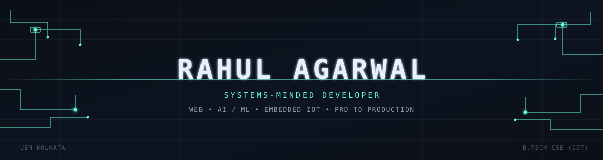
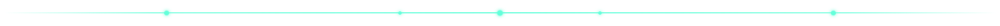

<div align="center">



<br/><br/>


<br/>

<a href="https://rahul-agarwal-portfolio.vercel.app"></a>
<a href="https://linkedin.com/in/igrahul"></a>
<a href="mailto:rahulagarwal40046@gmail.com"></a>
<a href="https://github.com/rahul4172"></a>

</div>



<table align="center">
<tr>
<td width="58%" valign="top">

```yaml
role:          Full-Stack & AI/ML Developer
studying:      B.Tech CSE (IoT), UEM Kolkata — 2025 to 2029
research:      IEDC Laboratory — clinical risk prediction systems
approach:      ship end-to-end — PRD, model, deployment, no gaps
organizing:    IGNITIA 2026, flagship tech fest — Aug 1-2
```

</td>
<td width="42%" valign="top">

```yaml
gpa:           8.07 / 10.00
domains:       web · embedded · applied ML
awarded:       Best Working Member, MSS
recognized:    Special Mention, Codexify
```

</td>
</tr>
</table>


<h2 align="center">Featured Builds</h2>

<table align="center" width="100%">
<tr>
<td width="50%" valign="top">
<h3>🩺&nbsp; SmartVital</h3>
<i>AI-powered multi-disease clinical risk prediction platform</i>
<br/><br/>


- Custom ANN models (Dense–Dropout–Sigmoid) for 4 disease risks; SMOTE + weighted loss for class imbalance
- SHAP/LIME explainability and a What-If simulator — predictions clinicians can actually interrogate
- Live ESP32/WebSocket vitals, role-based JWT auth, Groq-hosted Llama 3.1 health assistant

</td>
<td width="50%" valign="top">
<h3>🤝&nbsp; HackMatch</h3>
<i>Real-time hackathon teammate-matchmaking platform</i>
<br/><br/>


- Custom Synergy Score algorithm matches teammates by compatibility, not keyword overlap
- ECDH/AES-GCM end-to-end encrypted chat, built in — not bolted on after
- Full PRD and deployment kit shipped: Docker, Render, Railway, Fly.io

</td>
</tr>
<tr>
<td width="50%" valign="top">
<h3>🚨&nbsp; TRINETRA</h3>
<i>AI-powered emergency response system</i>
<br/><br/>


- ESP32 wearable + Flask AI backend: facial stress detection, live GPS, automated SMS alerts
- Engineered for the critical 10-minute emergency response window
- Under ₹500 per unit — built for real-world scale, not a demo

</td>
<td width="50%" valign="top">
<h3>🌱&nbsp; AquaSense</h3>
<i>Smart irrigation & environmental monitoring system</i>
<br/><br/>


- Multi-sensor ESP32 rig automates irrigation from soil moisture, temperature, humidity
- ML modules for crop health classification, disease prediction, yield forecasting

</td>
</tr>
</table>


<div align="center">

<h2>Stack</h2>


</div>


<div align="center">

<h2>Metrics</h2>


<br/><br/>


</div>


<div align="center">

<h2>Recognition</h2>

🏅 &nbsp;**Special Mention**, Codexify — *GoClever*, AI-powered travel intelligence platform
&nbsp;&nbsp;&#183;&nbsp;&nbsp;
🏅 &nbsp;**Best Working Member**, Microsoft Student Society
&nbsp;&nbsp;&#183;&nbsp;&nbsp;
🚀 &nbsp;Built **RouteIQ** at Techno India Batanagar hackathon
&nbsp;&nbsp;&#183;&nbsp;&nbsp;
🚀 &nbsp;Competitor, **Hackolution 2K26**

<br/><br/>

<sub>UEM KOLKATA &nbsp;&#183;&nbsp; B.TECH CSE (IOT) &nbsp;&#183;&nbsp; 2025 — 2029</sub>

</div>
